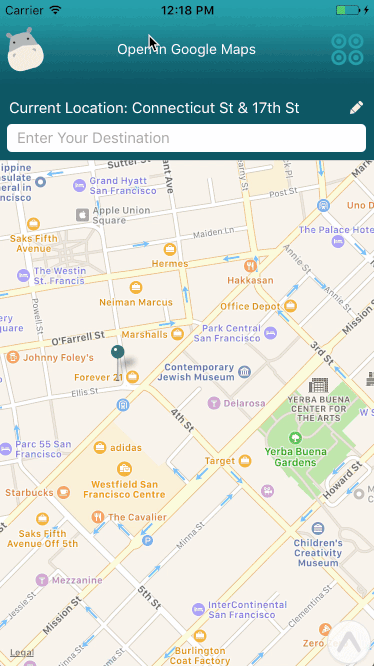

# Safe Hippo Mobile

> We all want to get home safe. By crunching real time crime data, Safe Hippo will show you the safest route home.

## Tech 
Safe Hippo is a Mobile App for both iOS and Android
- **Stack:** ReactNative, ExponentJS, Mongo, Redis, Node.js, Nginx, [AirMapView](https://github.com/airbnb/AirMapView)
- **APIs:** Google Directions API, Google Places API

## Team

Amad Khan, Benjamin Antalek, Meijiao Png, Tony Le

## Demo
 

## How Safe Hippo Works

  This section explains what happens 'under the hood' when a user interacts with Safe Hippo. 

- **Current Location**: HTML5 geolocation determines your current latitude & longitude. If unavailable, the user will be directed to fill it in their location. They can also change their location that was determined by geolocation.
- **Destination**: User fills out their desired destination. Autocomplete suggestions are provided via Google Places API.
- **Safest Route**:
   - **GET request** is sent to /safestRoute with the origin and destination coordinates in the params
   - **Event listeners:** The GET request will be triggered when both origin and destination are filled. After that, it will be triggered if the user updates either origin or destination.
   - **Caching:** We check our Redis DB to see if that particular route has been requested before. If it has, we return the safest route straight away.
   - If that route hasn't been requested before, we call the getSafestRoute method which does the following:
    * We query the Google Directions API which provides 3 potential routes to get from A to B.
    * We space the waypoints (lat,long pairs along a given route) out evenly using a helper function.
    * Our database contains every recorded crime that occured in San Francisco in 2015 with it's latitude and longitude. We populated the DB with data from the SF OpenData API at [this endpoint](https://data.sfgov.org/resource/ritf-b9ki.json). For each waypoint on a given route, we query the db to see how many crimes happen within 80 metres of that waypoint. Each waypoint has a crime score equal to how many crimes happened near that point. We then sum up how many crimes happened on each route - each route's score is the sum of all the waypoint's crime score on that route. We then return the route with the lowest crime score. This will be the route where the fewest recorded crimes have occured over the past year.
- **Heatmap for Crimes**:  A button on the top right corner of the app toggles a heatmap to show crime spots on the user's route. 
- **Google Maps URL** We provide the user with a link to Google Maps containing the directions of their safest route

## Future Roadmap

We think these improvements would make the app even more useful. Give us a shout if you're interested in working on them!

- Assess more 'dummy routes' than the 3 which Google Maps Directions gives us. New dummy routes could be suggested by specifying a random waypoint between origin and destination.
-  This app is currently best used to determine a safe route for the last mile journey of walking home. Improve the algorithm for longer distances. Suggestions: Ignore crime data for segments of the journey when the user is on a train/bus and only calculate the crime score for their walking segment.
- Validation on the client forms to reject locations outside of allowed cities (data is currently available only for SF on our app).
- Extend to more cities e.g. Chicago has a [crime statistics API](https://data.cityofchicago.org/api/views/ijzp-q8t2/rows.json?accessType=DOWNLOAD). Remember, the DB queries need to be in terms of distance on the Earth rather than latitude degrees because a 1 degree of latitude isn't the same Earth surface distance on the equator as it is at the poles.
- **Standalone apps**: If you want your family and friends to download the app directly through the app store, you would have to deploy a [standalone app](https://docs.getexponent.com/versions/v9.0.0/guides/building-standalone-apps.html)

## Contribution Guide

- Fork and Clone this repo 

- Installation: Open up the repo in your terminal and install packages. 
  - Install server-side packages: `npm install` in the root directory
    - Install Node 6+
    - Use "--no-optional" flag, like this:
    `npm install --no-optional`
  - Install client-side packages: `cd exponent; npm install`
  - Create API keys for Google Maps and follow the instructions in keysPlaceholder.js to add your keys.
  - Download [Exponent client](https://docs.getexponent.com/versions/v9.0.0/introduction/index.html), which provides a simulator to preview your app during development. 
    - Go to "Open Project" and open the exponent folder

## Questions? 
- Give us a shout! Message any one of us. You can also contact MJ @ meijiao@gmail.com
